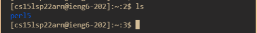
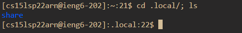

# Lab Week 2 - Report 1
## Installing VSCode

    I already had VSCode installed for previous CSE classes therefore I just took a screen shot of the application open on my mechine. 

**Choose Wisely**

[VSCode Link](https://youtu.be/dQw4w9WgXcQ)

[VSCode Link](https://code.visualstudio.com/)
***
 ## Remotely Connecting 
 

     After reseting my server password I used the ssh command to connect to the remote server. This is a screeenshot of what I see imditally after I log on. 
 ***
 ## Trying Some Command

    In this screenshot I am demonstrating the command ls which outputs all the files in a given diroctory.

***
## Moving Files with `scp`

    Using the scp command I moved the WhereAmI.java file form my mechine to the ssh server. This is a screenshot of me using the ls command in ssh to see if the file is there.

***
## Setting an SSH Key

    For this section I generated a SSH Key using the key-gen command and used it to set up easier entry into my ssh server. This is a screen shot of said ssh key being generated.
 
 ***

 ## Optimizing Remote Running
 

    In this section I began getting more conforable with ssh and began using more short cuts. For example, in the screenshot above you can see me using a semi-colon to run two commands on a single line so that I can open a new diroctory and see all of its files. 