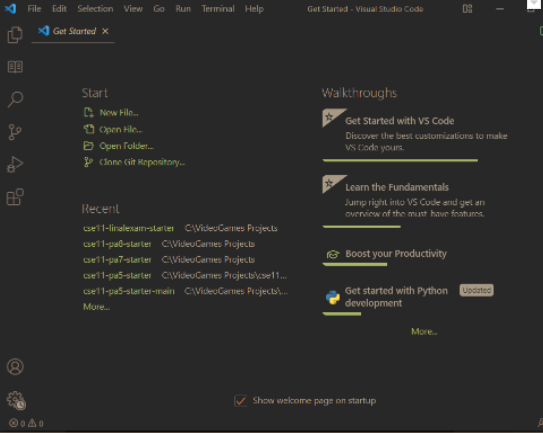
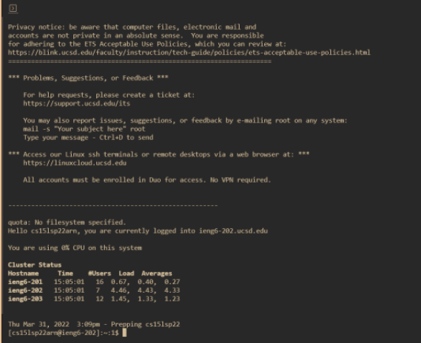
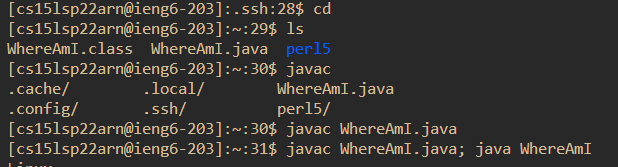
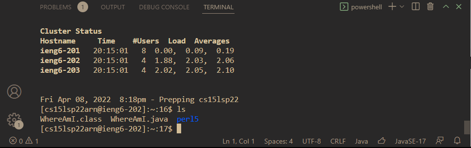
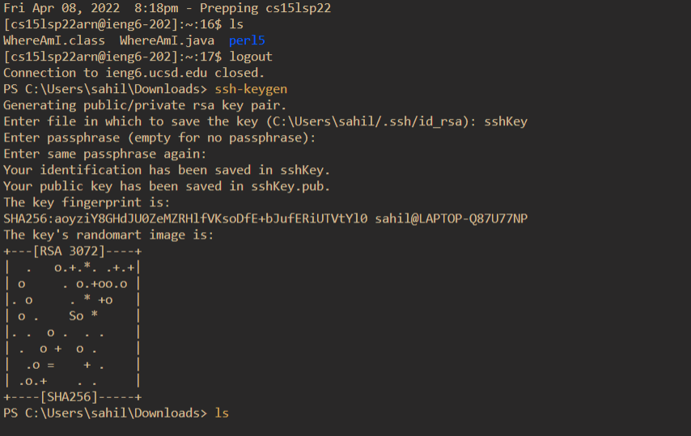
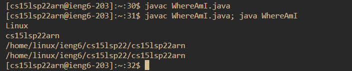

# Lab Week 2 - Report 1
## by Sahil Gathe
April 10, 2022

<br>

# Remote Access for Beginners! 
We are often used coding on our own hardware and on local mechines. However what if we want to collabrate or access code from UCSD? In these cases we can access UCSD servers ***remotely!*** This guide will give an overview on how to log into the UCSD ```ieng 6``` server. Moreover we can use a **secure socket shell** (```ssh``` for short) to easily access you teh course server!

<br>


# 1. Installing VSCode
VScode is a texted editore which can used to access the ```ieng 6``` server form your computer using its built in terminal. 

[VSCode Link](https://code.visualstudio.com/)

**First** click the link above and follow the install prompts to install VScode onto you mechine. 



After installing you should be greeted with this home screen!

<br>

# Remotely Connecting 
Now you are ready to connect to the ```ieng 6``` server. 

* **First** if your on a **Windows Mechine** you may need to install the [OpenSSH program](https://docs.microsoft.com/en-us/windows-server/administration/openssh/openssh_install_firstuse) follow to instrections in the following link to complete that prosses.

Next all users will have to find the course-spefic account using the [UCSD Accound Lookup Tool](https://sdacs.ucsd.edu/~icc/index.php). You may need to reset your password which will take about 15 minutes to prosses to just chill for a little which that is happening. 

Now we can connect to the **remote server!**

1. **First** open the VSCode terminal by going to the top left of the windown clicking the terminal tab and seclecting the ***new terminal*** option.

2. **Next** when the terminal is open enter the following command after the ```$``` sign ```ssh cs15lsp22zz@ieng6.ucsd.edu``` ensure to replace the *zz* with your acount user in my cause it would be ```ssh cs15lsp22arn@ieng6.ucsd.edu```.

3. Enter your passwords and you should be greeted with the following screen

 

If you see this in your terminal then that means that your are offically on the server!!

<br>

# Trying Some Command

Once you are in the server you can use commands to navigate through the files and even create you own files to code!

Here is a small list of commands to try:
* ```cd``` which will change your directory 
* ```ls -a``` which will list all the files in your current direcotry
* ```ls =lat``` whou will list all the files by date on your direcotry
* ```cp``` which copies a file
* ```rm ``` which removes a file

Here's an examples of a few commands being used!



<br>

# Moving Files with ```scp```

Sometimes we may want to move files form our local mechine to the server to do this we can use the ```scp``` command

* ``` scp <File Name>``` 

After call this command you'll be propted to input your passwords after that you should see your file in the server! To check if this is true you can use the ```ls``` command

In the following image I used the ```scp``` command to copy over the file WhereAmI.java and run it in the server. 



<br>

# Setting an SSH Key
By now you are probbly sick of having to type in your password evertime you need to access the server form your mechines, so we can create and use **ssh keys** to automatically login for us!

1. **First** use the ```ssh-keygen``` to generate a key on your local mechine. You should be prompted with the screen below if this was done right. 



2. This command will set up a **private** and a **public** key. You want use the ```ssh scp``` command to move the ```id_rsa.pub``` file on to the server. **ENSURE** that you are moving over the public key by ensure the the files ends with ```.pub``` or this woun't work!

If done right you should be able to access your server without need to enter a password!

<br>

# Optimizing Remote Running


In this section you can more conforable with ssh and began using more short cuts. For example, in the screenshot above you can see me using a ```;``` to run two commands on a single line. In the screen shot I used the command to **both compile and run my code remoatly on one line!** Also I used the tab key to autofill commands when available. 